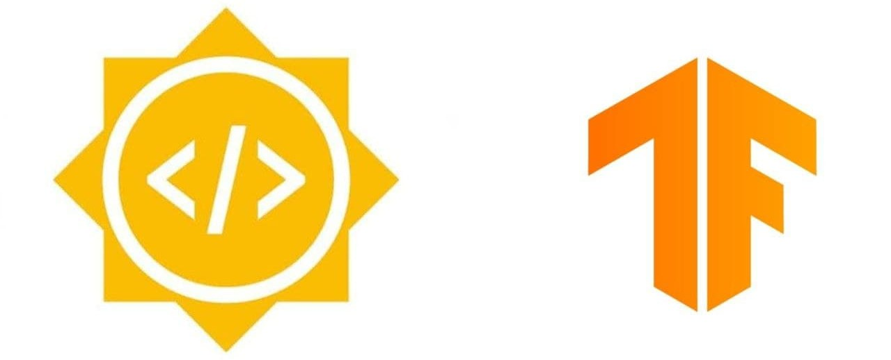

 

  
  <h1 align="center">Improving TensorFlow GAN library</h1>

  <a href="https://summerofcode.withgoogle.com/projects/#4563139045097472">Project Link</a> |
  <a href="https://github.com/tensorflow/gan">TF-GAN Library</a>

 

## Project Abstract

[TensorFlow GAN](https://github.com/tensorflow/gan) is a lightweight library for training and evaluating Generative Adversarial Networks. Through this GSoC project I will be implementing more variants of GANs that are more recent and have more applications, using TF-GAN which will be then added as examples to the library.

**Mentor**: [@margaretmz](https://github.com/margaretmz)

## Tasks
|Tasks|Reference|Status|
|:-:|:-:|:-:|
|Train and Evaluate ESRGAN model.|[Here](esrgan)| :heavy_check_mark: |
|Write Colab notebook for training ESRGAN and exploring different functionalities of TF-GAN. |[Here](esrgan/colab_notebook)|  :heavy_check_mark:|
|Train and Evaluate ControlGAN model.|Here| Ongoing |
|Write Colab notebook for training ControlGAN and exploring different functionalities of TF-GAN. |Here| Ongoing |
|Add TPU support for both ESRGAN and ControlGAN.|Here| Pending |
|Work on new datasets.|Here| Pending |
|Write blog posts/tutorials for ControlGAN.|Here| Pending |
|Make other improvements to the library |Here| Pending |
